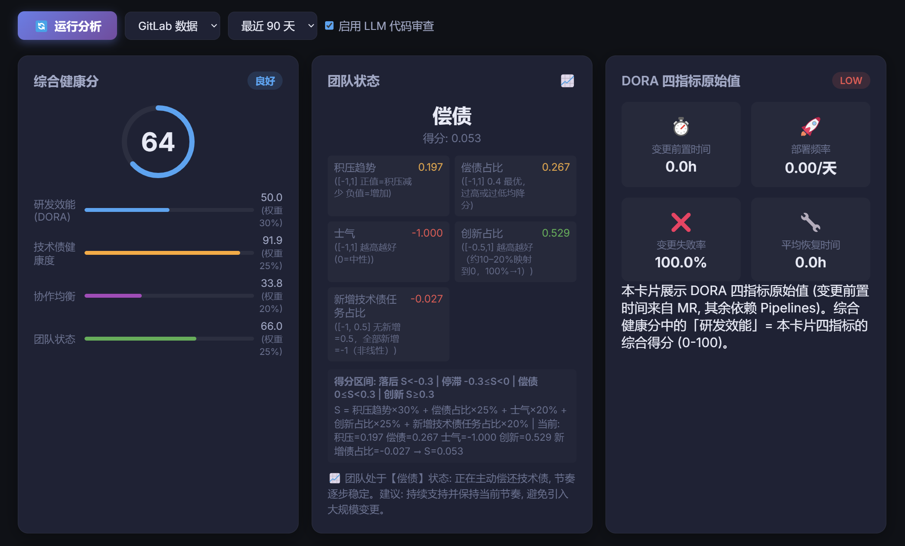
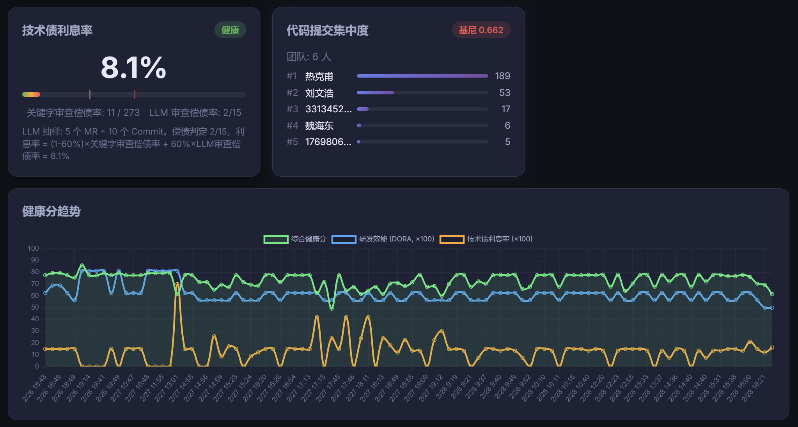
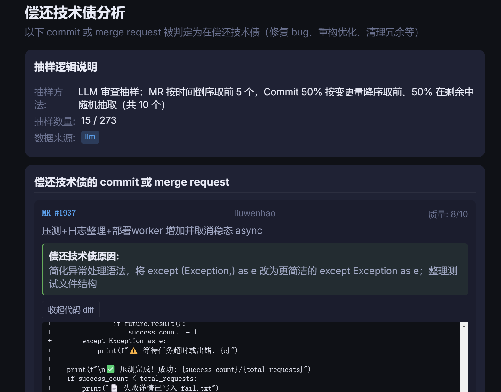
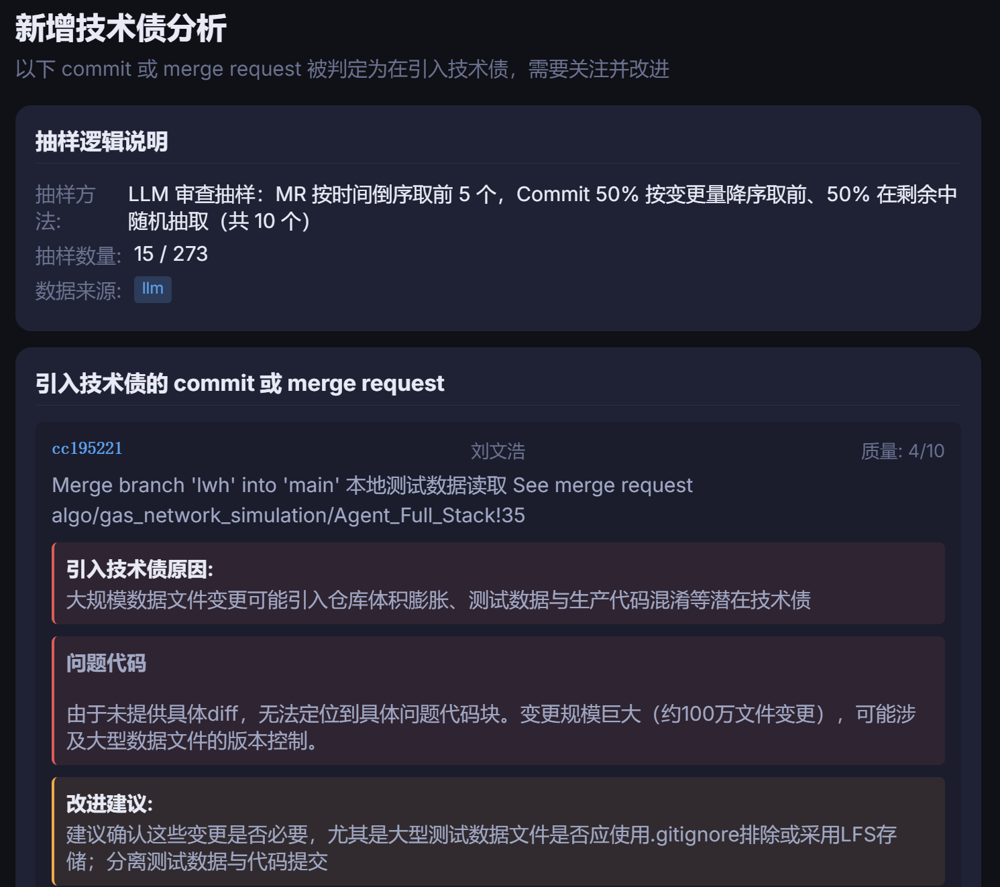
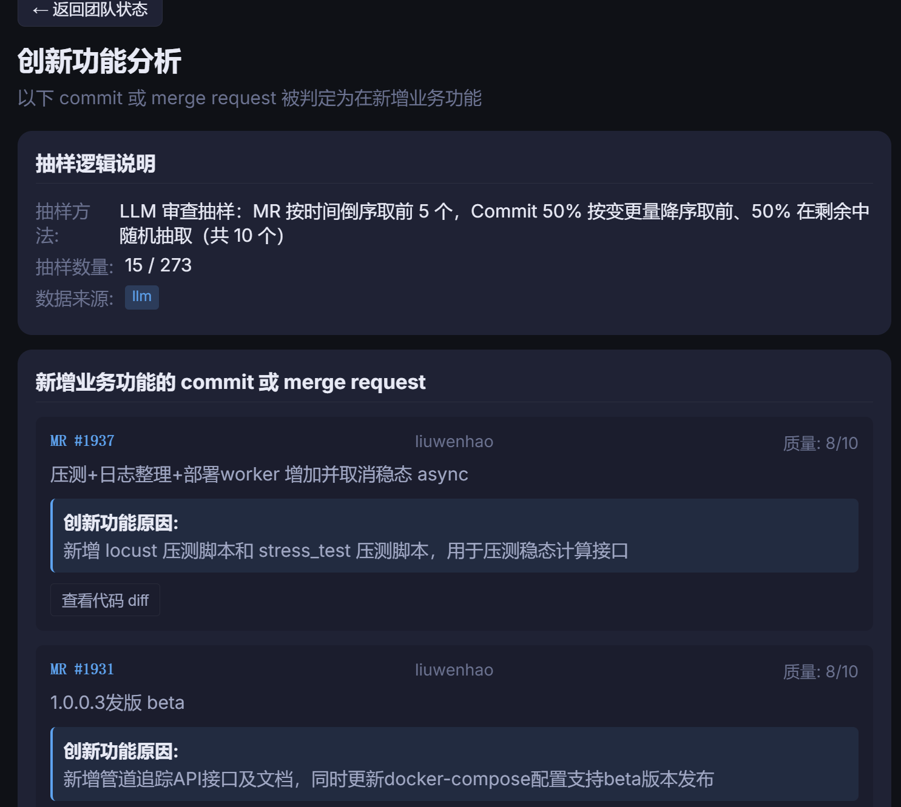

# AI 技术管理工具 (tech_mgmt_ai) - 产品 1.0

> **版本**: 1.0 | **状态**: MVP 已完成

基于《An Elegant Puzzle》(工程管理的要素) 一书，为中高层技术管理者提供数据驱动的管理决策支持。

## 产品截图

### 1. 综合健康分看板 (主视图)





展示团队的综合健康分（0-100 分）、各维度评分卡片（技术债利息率、研发效能 DORA、团队状态、英雄分布），以及历史趋势图。

### 2. 偿还技术债分析 (数据下钻)



下钻查看被判定为「偿还技术债」的 commit/MR 列表，包含 LLM 审查原因、代码质量评分及判定依据。

### 3. 新增技术债分析页面 (数据下钻)



下钻查看被判定为「引入技术债」的 commit/MR 列表，展示问题原因、问题代码块（Markdown 代码块格式）及改进建议。

### 4. 新开发业务功能的代码分析 (数据下钻)



下钻查看被判定为「新增业务功能」的 commit/MR 列表，分析创新占比及功能分布。

---

## 架构概览

```
感知层 (Sensors)          认知层 (Cognition)       逻辑层 (Logic)            执行层 (Actuators)
┌──────────────┐         ┌──────────────┐        ┌──────────────┐         ┌──────────────┐
│ GitLab API   │───────▶│ LLM 代码Review│──────▶│ 技术债利息率  │──────▶│ 综合健康分    │
│ (MR/Commit)  │        │ LLM 任务分类  │       │ DORA 四指标   │        │ 告警规则引擎  │
│              │        │              │        │ 团队状态诊断  │        │ 飞书/钉钉通知  │
│ 飞书 API     │        │              │        │ 英雄检测      │        │ Vue 管理看板  │
│ (Tasks/Bugs) │        │              │        │ 团队规模校准  │        │              │
└──────────────┘        └──────────────┘        └──────────────┘         └──────────────┘
```

## 核心模型与书籍映射

| 模块 | 书中章节 | 数学模型 |
|---|---|---|
| 团队四状态 | 1.2节 | 多维加权评分 S = w₁·backlog + w₂·debt + w₃·morale + w₄·innovation + w₅·creating_debt |
| 团队规模 | 1.1节 | 经理:工程师 = 1:6~8, 高级经理:经理 = 1:4~6 |
| 技术债 | 2.5/2.6节 | 利息率 I = fix_changes / total_changes |
| DORA 指标 | 2.1节 | Lead Time, Deploy Freq, CFR, MTTR (4级分类) |
| 英雄检测 | 4.6节 | 基尼系数 (代码提交集中度) |
| 综合健康分 | 附录 | 加权聚合: 0-100 分 |

## 核心功能

### 1. 综合健康分
- 五个维度加权汇总：DORA 指标、技术债、英雄检测、团队状态、团队规模
- 每个维度 20% 权重，综合得分 0-100 分

### 2. 技术债分析
- **关键字审查偿债率**: 通过 commit message 关键词（fix, bugfix, hotfix 等）识别偿还技术债的提交
- **LLM 审查偿债率**: 通过大模型分析代码变更语义，判断是偿还技术债还是引入技术债
- **技术债利息率**: 加权混合关键字与 LLM 判断，公式: `I = (1-w)×关键字 + w×LLM`

### 3. 团队状态诊断
五维加权评分模型：
- **积压趋势** (20%): 有 Issues 时 (关闭-新增)/积压；无 Issues 时 MR 合并率中性化 (85% 为 0)
- **偿债占比** (20%): 非线性映射，40% 偿债率为最优 (得分 1)，过高或过低均降分
- **士气** (20%): Code Review 评论数 / 团队人数，2×归一化 -1
- **创新占比** (20%): 非线性映射，0%→-0.5，约 15%→0，100%→1
- **新增技术债任务占比** (20%): 非线性放大惩罚，0→0.5，3/8→-0.2，全部→-1

状态判定: 落后 S<-0.3 | 停滞 -0.3≤S<0 | 偿债 0≤S<0.3 | 创新 S≥0.3

### 4. DORA 四指标
- Lead Time (变更前置时间): 从首次提交到合并的时间
- Deploy Frequency (部署频率): 成功部署数 / 天数
- Change Failure Rate (变更失败率): 失败部署数 / 总部署数
- MTTR (平均恢复时间): 失败后恢复时间均值

### 5. 英雄检测
- 基尼系数衡量代码提交集中度，0=均匀分布，1=一人提交全部
- 识别 top 贡献者及贡献占比

### 6. 数据下钻
- 支持「偿债占比」「创新占比」「新增技术债任务占比」三个维度的数据下钻
- 展示每条 commit/MR 的 LLM 审查结果：判定类别、原因、问题代码块、改进建议
- 抽样逻辑: MR 按时间倒序，Commit 50% 按变更量降序 + 50% 随机抽取

---

## 快速开始 (Docker)

```bash
# 1. 复制配置文件 (必须, docker-compose 依赖 .env 注入环境变量)
cp .env_example .env
# 编辑 .env 填入 LLM API Key (可选) 和 GitLab Token (可选)
# 使用 mock 数据源时可不配置 GitLab, 直接运行分析即可

# 2. 一键启动全部服务
docker compose up -d --build

# 3. 开发模式 (代码变更自动同步/重启)
docker compose watch

# 4. 访问
#   前端看板: http://localhost:3000
#   后端 API: http://localhost:8000/docs (Swagger UI)
```

> **注意**: 若 `.env` 不存在, docker-compose 会因 `env_file: .env` 报错。请务必先执行 `cp .env_example .env`。

### Docker 服务

| 服务 | 端口 | 说明 |
|---|---|---|
| frontend | 3000 | Vue 3 管理看板 (nginx) |
| backend | 8000 | FastAPI REST API |
| postgres | 5432 | PostgreSQL 指标存储 |

### 数据库: SQLite 与 PostgreSQL

- **Docker 部署**: 使用 PostgreSQL (由 docker-compose 注入 `DATABASE_URL`)
- **本地开发**: 未设置 `DATABASE_URL` 时自动回退到 SQLite (`tech_mgmt_ai.db`)
- 逻辑见 `tech_mgmt_ai/storage/database.py` 的 `get_database_url()`

## 本地开发

```bash
# 后端
pip install -e ".[dev]"
uvicorn tech_mgmt_ai.api.app:app --reload --port 8000

# 前端
cd frontend && npm install && npm run dev

# CLI 模式
python -m tech_mgmt_ai analyze
python -m tech_mgmt_ai team-sizing --engineers 24 --managers 3

# 测试
pytest tests/ -v
```

## 指标计算逻辑

| 指标 | 数据来源 | 计算公式 |
|------|----------|----------|
| **技术债利息率** | Commits | `fix_changes / total_changes`（按代码行数）；无 stats 时用 `fix_count / total_count` 兜底 |
| **英雄检测 (基尼)** | Commits | 基尼系数衡量提交集中度，0=均匀，1=集中 |
| **DORA Lead Time** | 已合并 MR | `mean(merged_at - created_at)` |
| **DORA 部署频率** | Pipelines | `成功部署数 / 天数` |
| **DORA 变更失败率** | Pipelines | `失败部署数 / 总部署数` |
| **DORA MTTR** | Pipelines | 失败→成功的时间差均值 |
| **团队状态** | Issues + MR 评论 | 积压趋势、债务占比、士气(Review 参与)、创新占比、新增技术债占比 |

**说明**：Pipeline 需 Token 有 `read_api` 权限；项目 107 返回 403 时需检查 Token 权限。Issues 为 0 时团队状态各维度均为 0。

## LLM 集成

产品 1.0 已完整集成 LLM 进行代码审查：

### 支持的 LLM 提供商
- OpenAI (GPT-4o, GPT-4o-mini 等)
- DeepSeek
- 智谱 (GLM-4)
- Ollama (本地模型)
- Anthropic (Claude)
- OpenAI Compatible API
- Azure OpenAI
- Google Gemini
- Groq
- AWS Bedrock

### LLM 代码审查
- **输入**: MR diff 或 Commit 伪 diff (含变更规模信息)
- **输出**: 结构化 JSON (通过 LangChain bind_tools)
  - `quality_score`: 代码质量评分 1-10
  - `is_paying_debt`: 是否偿还技术债
  - `is_creating_debt`: 是否引入技术债
  - `is_creating_debt_code_block`: 问题代码块 (Markdown 格式)
  - `is_creating_debt_correct_action`: 改进建议
  - `is_adding_new_function`: 是否新增业务功能
  - `summary`: 一句话总结

### 抽样策略
- MR: 按时间倒序取前 N 个 (默认 3)
- Commit: 50% 按变更量降序取前 N/2 个，50% 在剩余中随机抽取 (默认 5)

---

## 配置说明

所有配置通过 `.env` 文件管理，包括：
- **数据源**: GitLab URL/Token、飞书凭证
- **LLM 服务**: 基于 LangChain 构建，支持 OpenAI / Deepseek / 智谱 / Ollama / Anthropic。通过 Tool Binding 实现结构化的代码 Review 和任务分类。
- **模型系数**: 每个数学模型的权重和阈值，均可独立调整

详见 `.env_example` 中的注释说明。

## 更新日志 (1.0)

- ✅ 综合健康分看板 (五维度加权)
- ✅ 技术债利息率 (关键字 + LLM 混合)
- ✅ 团队状态诊断 (五维评分模型)
- ✅ DORA 四指标
- ✅ 英雄检测 (基尼系数)
- ✅ 数据下钻 (偿债/创新/新增债)
- ✅ LLM 代码审查 (结构化输出)
- ✅ Commit 抽样策略 (50% 变更量 + 50% 随机)
- ✅ 前端超时 60s 支持大模型调用
